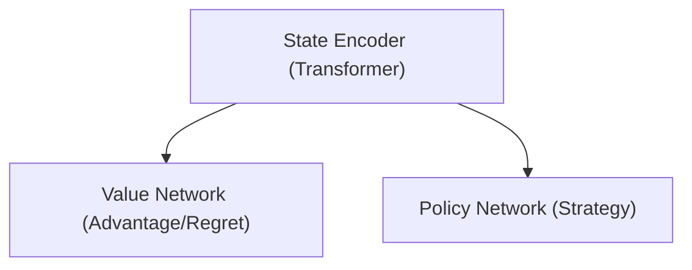

# Future Improvements for Deep CFR Poker

This document outlines planned improvements and enhancements for the Deep CFR Texas Hold'em implementation. Each item can be checked off as it is implemented.

## Model Architecture Enhancements

- [ ] **Attention Mechanisms**: Incorporate attention-based components to help the model focus on important state features
- [ ] **Residual Connections**: Add residual connections to improve gradient flow for deeper networks
- [x] **Separate Value/Policy Networks**: Experiment with more specialized architectures for advantage and strategy networks
- [ ] **Add Batch Normalization**: Include batch normalization to stabilize training
- [ ] **Experiment with Transformer-based architecture**: Test if transformers are more effective than standard feedforward networks for poker

### New Model Architectures design for transformers

## Action Space Refinement

- [x] **Continuous Bet Sizing**: Replace discrete bet actions with continuous sizing prediction
- [ ] **Multi-Stage Action Selection**: First predict action type, then predict sizing in a secondary step
- [ ] **Expand Raise Options**: Add more granular bet sizes (e.g., 0.3x, 0.7x, 1.5x, 2x pot)
- [ ] **All-In Awareness**: Add special handling and considerations for all-in decisions

## Training Improvements

- [ ] **Progressive Learning Rate Scheduling**: Implement dynamic learning rate reduction over training
- [ ] **Curriculum Learning**: Start with simpler poker scenarios and increase complexity
- [ ] **Parameter Freezing**: Try training strategy network while freezing advantage network and vice versa
- [ ] **Data Augmentation**: Implement hand translation (suit isomorphisms) to increase effective training data
- [ ] **Adaptive Sampling**: Focus traversals on more complex/interesting game states

## Advanced Techniques

- [ ] **Counterfactual Value Networks**: Implement CFV approach as an alternative to traditional CFR
- [ ] **Public Belief State Representations**: Use public belief states to reduce variance
- [ ] **Meta-Learning**: Train the model to quickly adapt to different opponents
- [ ] **Discounted CFR**: Implement weighting of regrets with discount factors
- [ ] **Robust Strategy Profiles**: Train multiple networks for different opponent profiles

## Memory and Opponent Modeling

- [x] **RNN for Opponent History**: Add a recurrent component to track and exploit player patterns
- [x] **Separate Opponent Models**: Maintain models for different opponent types
- [x] **Efficient Memory Replay**: Prioritize experiences based on surprise value
- [x] **Action Sequence Encoding**: Represent betting histories more effectively
- [ ] **Table Image Modeling**: Factor in how opponents might be perceiving the agent's own play style

## Evaluation and Analysis

- [ ] **Benchmark Against Known Bots**: Test against public poker bot implementations
- [ ] **Strategy Visualization**: Create tools to visualize learned strategies in different scenarios
- [ ] **Hand Range Analysis**: Add automated tools to analyze implied hand ranges
- [ ] **Real-Time Training Metrics**: Implement more sophisticated monitoring of training progress
- [ ] **Risk-Adjusted Evaluation**: Evaluate performance considering not just EV but also variance

## Code and Infrastructure

- [ ] **Code Optimization**: Improve performance-critical sections
- [ ] **Better Hyperparameter Management**: Add config files or command-line options for all hyperparameters
- [ ] **Interactive Development Environment**: Build a UI for testing different network configurations
- [ ] **Automated Testing**: Add unit and integration tests
- [ ] **Documentation Improvement**: Enhance code comments and documentation

## Deployment and Usability

- [ ] **Web Interface**: Create a web interface for playing against the trained model
- [ ] **API Endpoints**: Expose the agent through REST API for integration in other platforms
- [ ] **Export to ONNX**: Enable exporting models to ONNX format for deployment
- [ ] **Mobile Compatibility**: Optimize model for mobile inference
